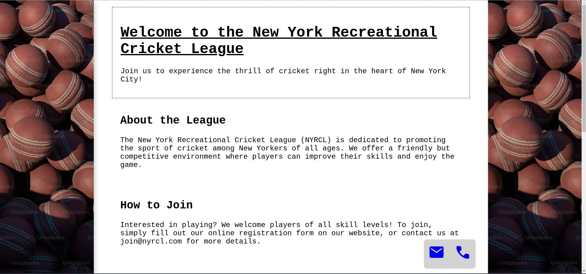

# landing-page-animation

_This is a submission for [Frontend Challenge v24.07.24](https://dev.to/challenges/frontend-2024-07-24), Glam Up My Markup: Recreation_

## What I Built

<!-- Tell us what you built and what you were looking to achieve. -->
Enhance design of the landing page. Uses javascript, css to make the [index.html](./index.html) page beautiful and interactive.

## Demo
<!-- Show us your project! You can directly embed an editor into this post (see the FAQ section from the challenge page) or you can share an image of your project and share a public link to the code. -->

## Journey
<!-- Tell us about your process, what you learned, anything you are particularly proud of, what you hope to do next, etc. -->

<!-- We encourage you to consider adding a license for your code. -->
